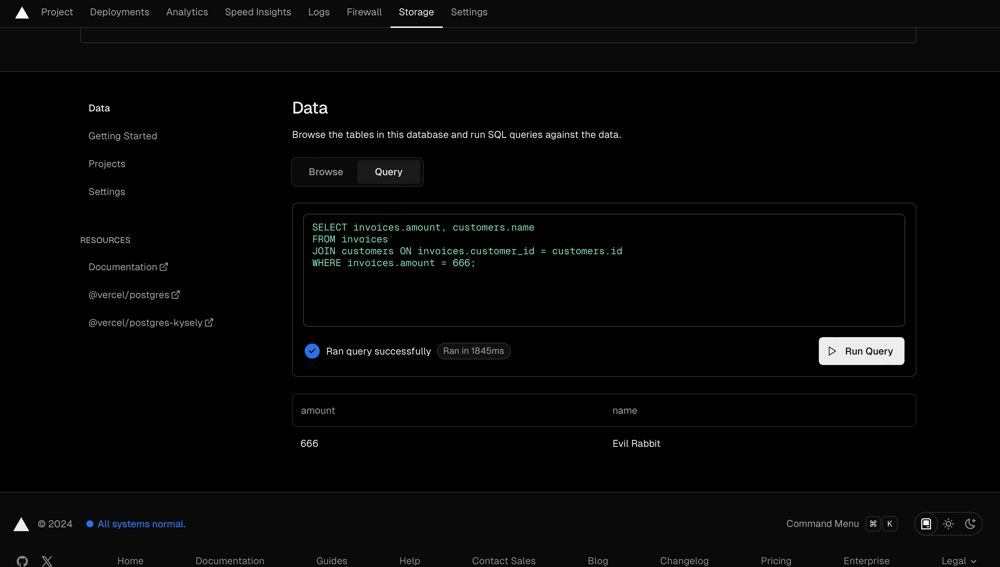
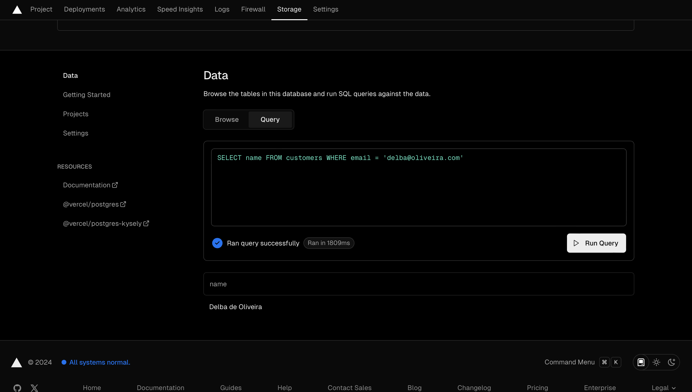

# 09 | Setup Database dan Fetching Data

## Praktikum 1: Setup Database

#### Langkah 1 : Membuat project baru dengan template

#### Langkah 2 : Membuat Akun Vercel

#### Langkah 3 : Koneksikan dan Deploy project Anda

### Soal 1 : Capture hasil deploy project Anda dan buatlah laporan di file `README.md.` Jelaskan apa yang telah Anda pelajari? Jangan lupa push dengan pesan commit: `"W09: Jawaban soal 1".`

> Saya telah berhasil mendeploy project saya ke `vercel`. Yang saya pelajari menggunakan `Vercel` adalah `Deploy website atau web app secara mudah dan cepat`, dan `Vercel` akan secara otomatis deploy kode ke server mereka, dan memberikan `URL untuk mengakses website atau web app.`

#### Langkah 4 : Membuat basis data Postgres

#### Langkah 5 : Akhirnya, jalankan perintah berikut di terminal untuk `install Vercel Postgres SDK.`

> `npm i --save @vercel/postgres`

### Soal 2 : Capture hasil basis data Anda dan buatlah laporan di file `README.md.` Jelaskan apa yang telah Anda pelajari? Jangan lupa push dengan pesan commit: `"W09: Jawaban soal 2".`

> Saya telah mempelajari bagaimana cara membuat `database dan menghubungkan dengan lokal dengan vercel`

#### Langkah 6 : Melakukan seed ke basis data

Selanjutnya, di file `package.json Anda,` tambahkan baris skrip seed seperti berikut:

#### Langkah 7 : Apa yang terjadi ? `error` atau berhasil insert data ke `database Postgre` ?
`Troubleshooting:` 
> Jika Anda mengalami error karena `module dotenv `tidak ada, silakan Anda dapat menginstallnya terlebih dahulu dengan perintah`npm i --save dotenv`

### Soal 3 : Capture hasil npm run seed Anda dan buatlah laporan di file `README.md.` Jelaskan apa yang telah Anda pelajari ? Jangan lupa push dengan pesan commit: `"W09: Jawaban soal 3".`

#### Langkah 8 : Menjelajah Basis Data

A. Buka akun `vercel` Anda, cek pada `sidenav` klik Data seperti gambar di bawah ini.

B. Anda dapat melakukan `query SQL` dengan klik `tab Query.`

### Soal 4 : Capture hasil query Anda dan buatlah laporan di file `README.md.` Jelaskan apa yang telah Anda pelajari ? Cobalah eksekusi query SQL yang lain sesuai kreasi Anda, capture hasilnya dan jelaskan! Jangan lupa push dengan pesan commit:`"W09: Jawaban soal 4".`

>berikut contoh hasil query saya dimana saya memilih kolom nama dari table customers jika email customers tersebut adalah `'delba@oliveira.com'`